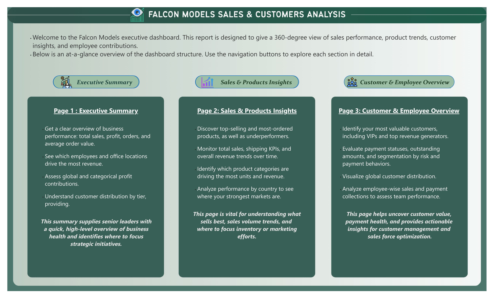
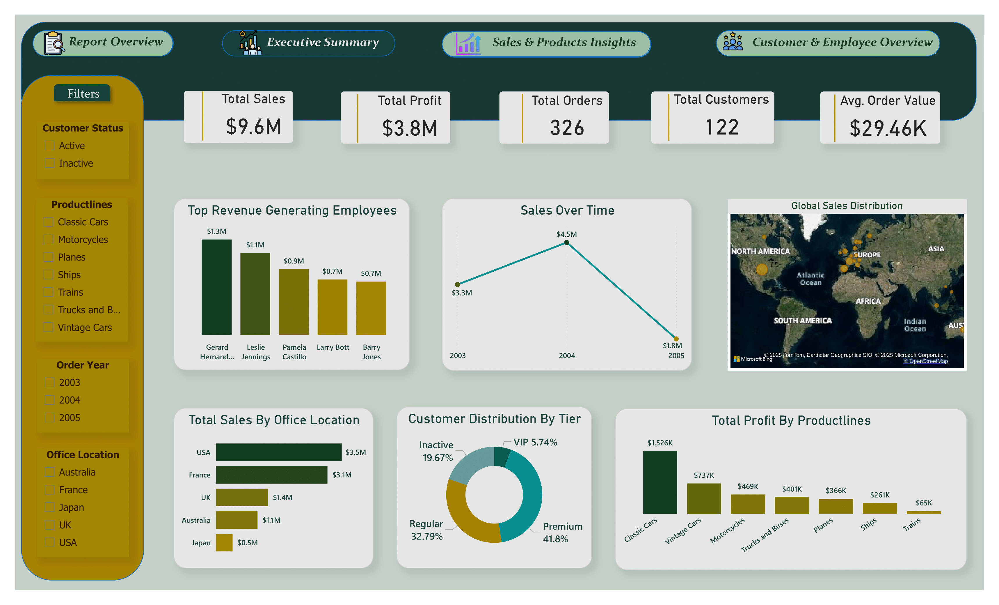
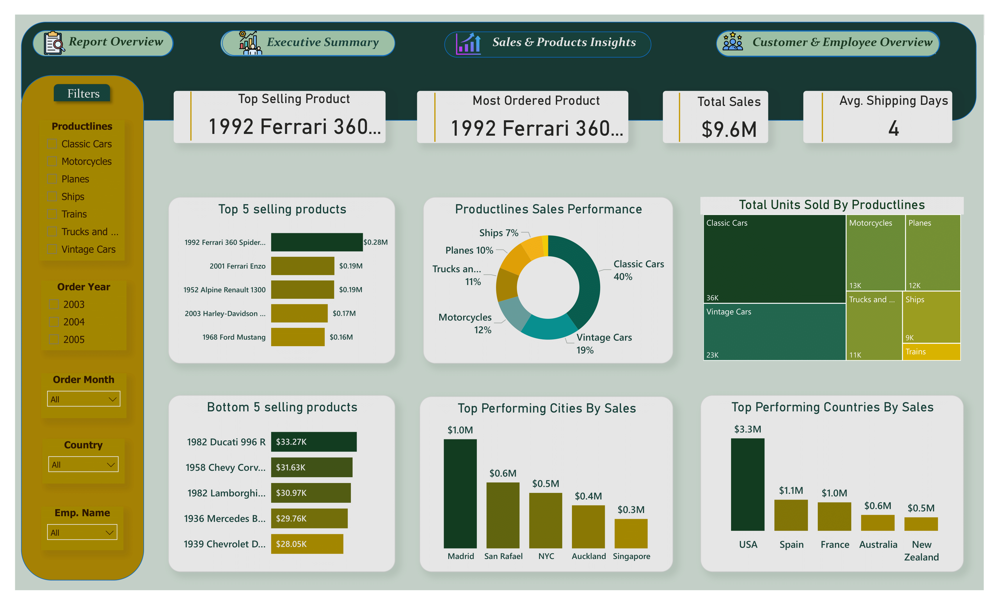

# 🦅 Falcon Models Business Analysis Project

## 📌 Project Overview  
This project focuses on **Falcon Models**, a customized adaptation of the **Classic Models dataset**, to analyze **customer behavior, credit and payment performance, and overall sales trends**.  
By integrating **SQL** for in-depth data analysis and **Power BI** for dynamic dashboards, the project delivers **clear, actionable insights** for better business decision-making and strategy building.

---

## 📂 Dataset Used    
[**Falcon Models Dataset (based on Classic Models)**](https://github.com/Ayushi0214/Datasets/blob/main/classic_models_dataset.zip)

---

## 🎯 Project Objectives  
- Analyze **customer-level sales, profits, and payments**.  
- Assess **payment gaps, performance ratios, and credit limits** to identify reliable and risky customers.  
- Create **customer segmentation and scoring** for better credit and sales strategies.  
- Build **interactive dashboards** to visualize KPIs and trends for decision-making.  
- Provide **insights and actionable recommendations** for business improvements.  

---

## 🛠️ Tools & Skills Used  
- 🗄️ **SQL** → Exploratory Data Analysis (EDA) for credit and payment patterns.  
- 📊 **Power BI** → Data cleaning, transformation (Power Query), and dashboard creation.  
- 📐 **Data Modeling & DAX** → For calculated measures, KPIs, and interactive reporting.  
- 🎨 **Canva** → Designing visual elements for enhanced presentations and storytelling.

---

## 🔍 Key Analysis Areas  
- Customer payment behavior and credit performance.  
- Profitability and payment gap metrics.  
- Credit risk identification and customer reliability segmentation.  
- Overall sales trends and performance breakdown.  

---

## 📁 Project Files  
- 📄 **Falcon Models Project Report.pdf** → Complete project documentation.  
- 📝 **README.md** → Project overview and key information.  
- 💻 **analysis-queries.sql** → All SQL scripts used for EDA and credit analysis.  
- 🖼️ **dashboard-1-overview.png** → Summary page with navigation to all dashboards.  
- 📈 **dashboard-2-executive.png** → Executive-level KPIs and insights.  
- 📉 **dashboard-3-sales.png** → Sales trends and product performance breakdown.  
- 👥 **dashboard-4-customers.png** → Customer segmentation, credit risk, and performance analysis.  

---

## 📊 Dashboards Preview  

**Overview Page**  

**Executive Dashboard**  

**Sales Dashboard**  

**Customers Dashboard**  

---

## 💡 Core Insights & Business Recommendations  
- **Payment Performance:** Most customers pay promptly, but a small group shows high payment gaps, indicating potential credit risks.  
- **Customer Segmentation:** High-value, reliable customers can be targeted for loyalty programs, while high-risk customers need stricter credit policies.  
- **Profitability Drivers:** Product lines like Classic Cars and Vintage Cars generate the highest profit margins.  
- **Sales Trends:** Consistent year-over-year growth, with notable seasonal spikes that can guide marketing strategies.  

---

## 📬 Contact  
**Kashish Pal**  
🌐 [**Portfolio**](https://kashishpal.framer.website) | 💼 [**LinkedIn**](http://www.linkedin.com/in/kashishpal04) | 💻 [**GitHub**](https://github.com/kashishpal4)

