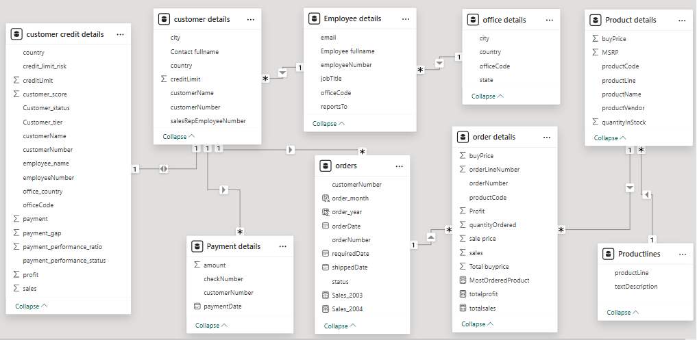
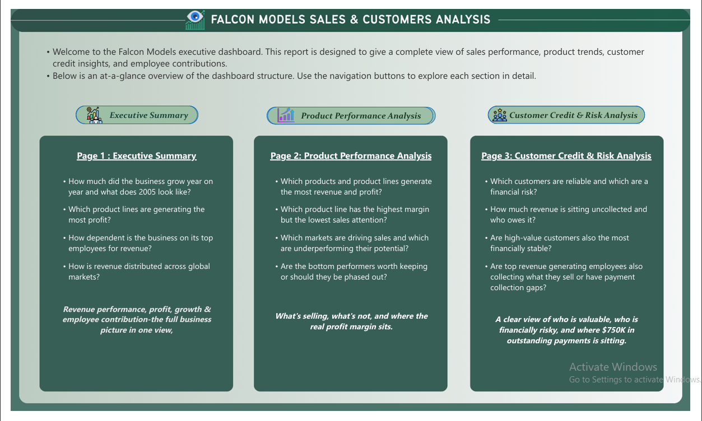
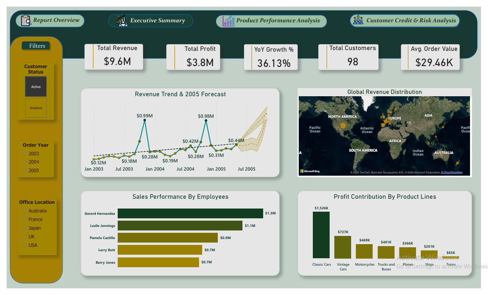
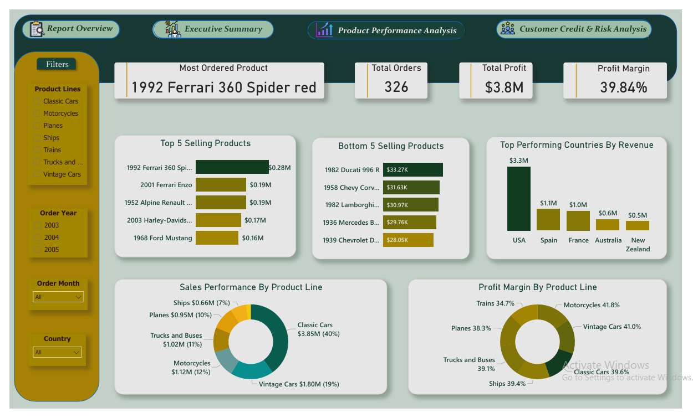
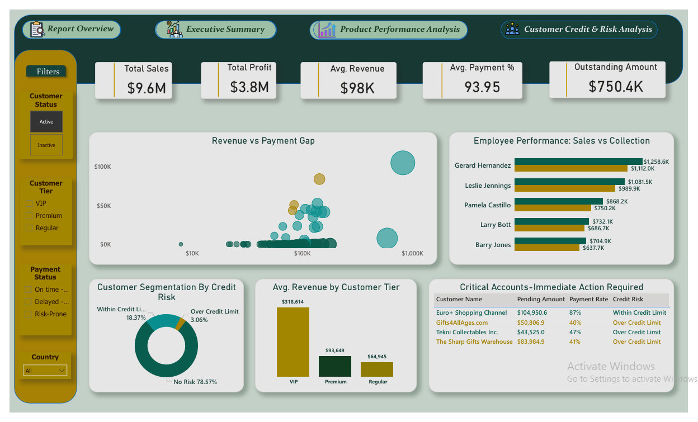

# Falcon Models — Sales & Credit Risk Analysis

End-to-end business analysis of a global scale model retailer 
using SQL and Power BI. Analysed three years of transactional 
data across 7 tables to identify $750K in outstanding payment 
risk, segment customers by credit health, and deliver 
prioritised recommendations for revenue stability and growth.

**Tools:** SQL (MySQL Workbench) · Power BI · Power Query · DAX  
**Dataset:** [Falcon Models Dataset (Based on Classic Models)](https://github.com/Ayushi0214/Datasets/blob/main/classic_models_dataset.zip)

---

## The Business Problem

Falcon Models had no clear view of which customers were
financially reliable, which product lines were worth investing
in, or where the next growth opportunity lay. Revenue appeared
stable but the business had significant outstanding balances
sitting unresolved, no customer credit health tracking, and
no structured way to identify where over-dependence was
building across customers, employees, and markets.

---

## SQL Approach

Built a 5-CTE analytical pipeline joining 7 tables to engineer
a customer credit scoring and segmentation model from scratch.

**CTE 1 — Sales Data:** Joins customers, orders, order details,
and products. Uses LEFT JOIN to include zero-order customers
in the analysis, not just active buyers.

**CTE 2 — Payment Data:** Aggregates total payments per
customer with COALESCE handling for nulls.

**CTE 3 — Base Data:** Engineers three derived columns —
payment gap (sales minus payments), payment performance
ratio, and credit limit risk classification per customer.

**CTE 4 — Scoring Data:** Assigns a 1–3 score to each
customer across three dimensions: sales volume, profit
contribution, and payment reliability.

**CTE 5 — Final Segmented:** Sums the three scores into a
composite customer score and assigns VIP, Premium, or
Regular tier based on defined thresholds.

Full query → [analysis-queries.sql](analysis-queries.sql)

---

## Data Model

Star schema across 9 tables: customers, orders, order details,
products, product lines, employees, payments, customer credits and offices.

---

## Dashboard Preview

Three-page interactive Power BI report with drill-downs,
cross-filters, and page navigation.

### Overview
*Navigation page summarising the purpose and structure
of each dashboard section*

### Page 1 — Executive Summary
*Overall business health: growth trajectory, profit by product
line, employee revenue contribution, and geographic distribution*

### Page 2 — Sales & Product Insights
*Product and market performance: top and bottom sellers,
profit margin by product line, and country revenue ranking*

### Page 3 — Customer Credit Analysis
*Credit risk mapping: payment performance segmentation,
revenue vs payment gap scatter plot, VIP account health,
and employee-level collection tracking*

---

## Key Findings

- Revenue grew **36.3% from $3.3M (2003) to $4.5M (2004)**
  with 2005 tracking ahead of pace through May
- **$750K in outstanding payments** across active customers —
  $565K from 13 customers paying less than 75% of what they owe
- The **highest-revenue customer** (Euro+ Shopping Channel,
  $820K) is the only VIP with unresolved outstanding balance
  of $104,951
- **3 employees drive 33% of total revenue** ($3.52M) with
  no knowledge-sharing or succession structure in place
- **Spain ranks 2nd globally** at $1.06M with no local office,
  outperforming UK and Japan which both have dedicated offices
- **Motorcycles** deliver the highest profit margin (40.7%)
  but represent only 11.7% of sales — the most underutilised
  line in the portfolio
- **November averages $983K** — Q4 alone contributes 38.4%
  of annual revenue creating heavy seasonal dependence

---

## Project Report

Full PDF including data model, dashboard documentation,
DAX measures, insights report, and strategic recommendations.

→ [Falcon_Models_Project_Report.pdf](Falcon_Models_Project_Report.pdf)

---

## Contact

**Kashish Pal**
[Portfolio](https://kashishpal.framer.website) ·
[LinkedIn](https://linkedin.com/in/kashishpal04) ·
[GitHub](https://github.com/kashishpal4) 

